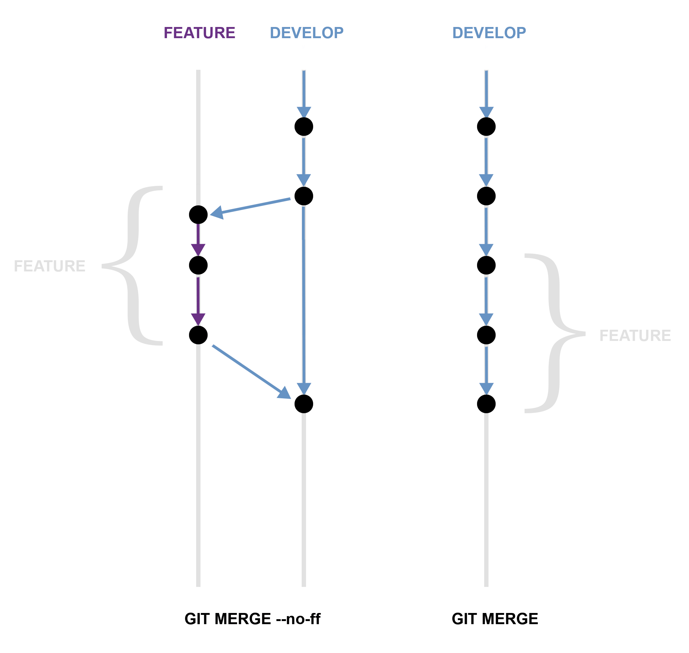

# Feature

- Criação a partir de: `dev`
- Deve ser mesclada em: `dev`
- Nomenclatura: `feature-*`

As branches `features` são usadas ​​para desenvolver novas funcionalidades para o próximo ou um lançamento em futuro distante. Ao iniciar o desenvolvimento de um recurso, a versão alvo em que esse recurso será incorporado, pode muito bem ser desconhecida nesse ponto. A essência de um branch de recurso é que ele existe enquanto o recurso está em desenvolvimento, mas acabará por ser mescladas de volta em dev (definitivamente adicionar o novo recurso para o lançamento) ou descartados (no caso de uma experiência decepcionante).

Os branches `features` normalmente existem em repositórios do desenvolvedor apenas, não em origin.

## Criando um branch feature

Quando começar a trabalhar em um novo recurso, se ramificam a partir do branch dev. 

```
$ git checkout -b myfeature dev
```

## Incorporando uma característica finalizada em dev

Recursos finalizados podem ser mesclados no branch dev definitivamente, para serem adicionados a próxima versão: 
```
$ git checkout dev
$ git merge --no-ff MyFeature
$ git branch -d MyFeature
$ git push origin dev
```

A flag `--no-ff` faz com que a impressão em série para criar sempre um novo objeto commit, mesmo que a fusão poderia ser realizada com um `fast-forward`. Isso evita a perda de informações sobre a existência histórica de um ramo de funcionalidade e reúne todos os commits que juntos adicionaram o recurso. Exemplo:



Neste último caso, é impossível ver a história Git qual dos objetos cometem juntos têm implementado um recurso de que você teria que ler manualmente todas as mensagens de log. Reverter uma característica totalmente (ou seja, um grupo de commit), é uma verdadeira dor de cabeça na última situação, enquanto ele é feito facilmente se o `--no-ff` foi usado.

Sim, ele vai criar um vazio no commit de objetos, mas o ganho é muito maior do que o custo. 

[< Voltar](https://github.com/doc-solutions/documentation-gitflow/blob/master/README.md)